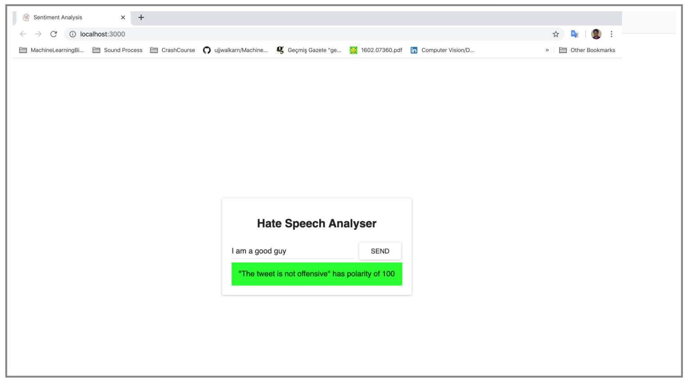
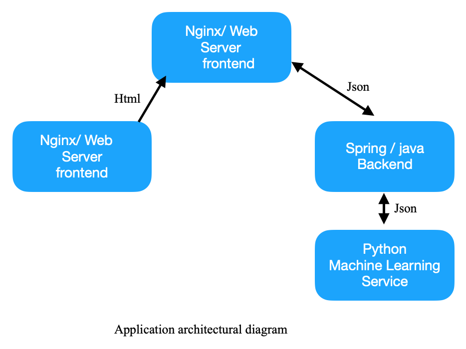
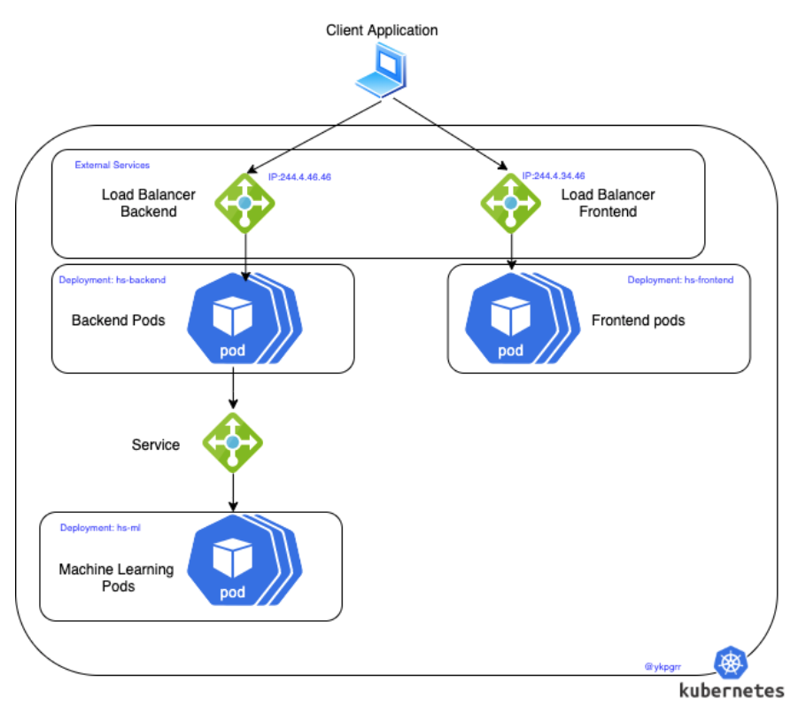
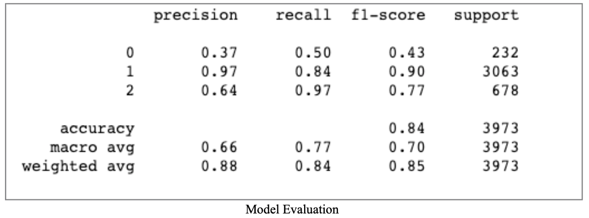

### Hate Speech Detection for tweets with k8s Cluster
###### Yakup Görür @ykpgrr yakup.gorur@gmail.com
 

** just for machine learning web service on pure python please go to the [master branch](https://github.com/ykpgrr/Hate-Speech-Detection/tree/master)

***Application demo:***

## Project Aims
In this project, worked on a machine learning problem for **hate speech and offensive language detection** for a given texts with aiming to using it with **kubernetes**.  

Projects has three main services which are **machine learning** service as a main part, an illustrated **backend service** and a basic **frontend web service**. 

Hate speech detection application is designed as an microservice architecture and managed with kubernetes cluster.  

## System Architecture

**Frontend:** a Nginx web server that serves ReactJS static files.  

**Backend:** a Java Web Application that handles requests from the frontend to illustrate backend service. For this project backend behaves like a web request handeler to make simple project.  

**Machine Learning Service:** a python application that performs Hate Speech Analyse.  

 As seen above ‘application architectural diagram’: backend communicate with ML service with an API using json file,  frontend communicate with backend with an API using json file, and also  the static html files uploading first running on application on the client.

## Kubernetes Architecture
Architectural diagram:

## Machine Learning Model
Key concepts:

- Dataset consist of two parts as train and test sets.
 - Train dataset: 19826 sentences  (~%85)
 - Test dataset: 3878 sentences (~%15)
 - Sentences are labeled as ’hate speech’ (label=0), ’offensive language’ (label=1) or ’neither’ (label=2).
- Preprocess applied on sentences.
 - Stopwords are removed.
 - Exclusion words are removed.
 - Words are tokenized.
- Feature generation methods are applied on sentences
 - Tfidf features are generated.
 - Counter of words features are generated.
 - Number of word, number of unique words, and character based embeddings are generated.
- Model trained.
 - LinearSVM, Logistic Regression, and GridSearch methods are used.
- Evaluation:
 - F1 score: %85  

workingspace, data and notebooks can be found under [NotebooksForModelTraining](NotebooksForModelTraining/)
